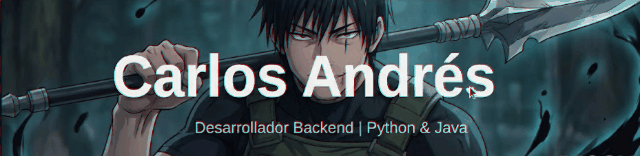

  

 

  

  
🌑 <b>Base de Operaciones: Bogotá, Colombia</b> 🇨🇴

  

 

  

 

## ⚔️ Perfil de Combate (Sobre mí)

<table>
  <tr>
    <td width="60%" valign="top">
      <h3>"No necesito talento, tengo disciplina."</h3>
      

        Como <b>Toji Fushiguro</b>, he perfeccionado mis habilidades para no depender de la suerte. Soy un desarrollador <b>Backend</b> especializado en <b>Java y Python</b>, enfocado en crear sistemas robustos y eficientes.
          
        Mi código sigue una regla simple: <b>cero energía desperdiciada, máximo impacto</b>.
      

      <ul>
        <li>🗡️ <b>Arma Principal:</b> Spring Boot & Python.</li>
        <li>🧬 <b>Especialidad:</b> Arquitectura de Software y APIs REST.</li>
        <li>🎯 <b>Objetivo:</b> Dominar el despliegue en la nube.</li>
        <li>⚡ <b>Filosofía:</b> <i>"Si el código funciona, no lo toques... optimízalo."</i></li>
      </ul>
       
      
    </td>
    <td width="40%">
      

        
      

    </td>
  </tr>
</table>

 

  

 

## 🎒 Inventario de Maldiciones (Tech Stack)

### > Lenguajes & Backend

  

### > Herramientas de Batalla

  

 

  

## 🌐 Red de Información

  
  
   
  

 

Copyright © 2026 Carlos Andrés | Zenin Clan Reject
an Reject

